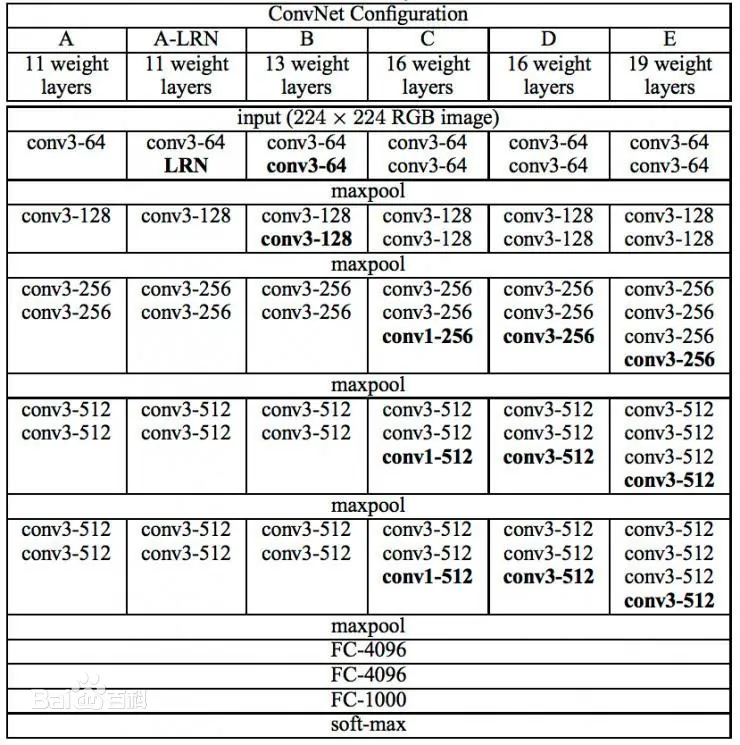

# 学习笔记
数据集修改：通过函数将数据集的target从小类标签转换为大类标签：  

  

数据增强：通过变换数据，增加数据集中相关数据的数据量，从而提高网络的拟合能力，提高正确率  
使用了随机剪切（Randomcrop）,随机翻转（RandomHorizontalFlip，RandomVerticalFlip）改变图片的亮度，色调与对比度（ColorJitter），从而达成更好的训练效果，防止过拟合。
## CNN模型：
针对VGG网络结构展开学习  
VGG网络模型结构：
  
经过研究，发现VGG-11拟合效果最好，通过训练达成了测试集百分之65成功率的目标，但仍存在过拟合的问题。

## RNN模型：
针对LSTM模型展开学习
LSTM网络模型结构：

经过研究，发现LSTM网络模型对图片数据的拟合效果并不好，成功约为百分之40